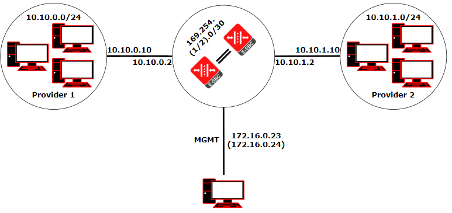
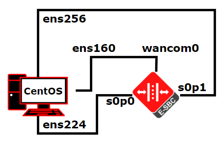
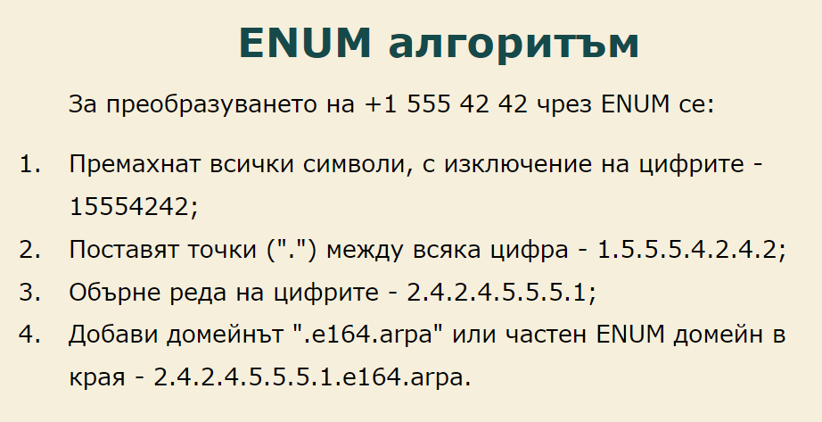

# VoIP мрежа с външен ENUM сървър

## [Викторио Миланов, 12Г](https://www.github.com/milanovviktorio)

Разработване на технологично решение, свързващо два VoIP доставчика на услуги чрез външен ENUM сървър. Дипломната работа успешно реализира гласова свързаност между двете мрежи

## Съдържание

1. [Логическа топология](#Логическа-топология)
2. [Физическа топология](#Физическа-топология)
3. [Използвани протоколи и технологии](#Използвани-протоколи-и-технологии)
4. [ENUM и HMR](#ENUM-и-HMR)
5. [Примерно обаждане и NAPTR записи](#Примерно-обаждане-и-NAPTR-записи)
6. [Видео](#Видео)
7. [ТУЕС Фест постер](#ТУЕС-Фест-постер)

## Логическа топология

## Физическа-топология

## Използвани протоколи и технологии

- **VoIP**
  - **SIP**
  - **SDP**
  - **RTP**
- **ENUM**
  - **DNS**
  - **NAPTR**
- **SBC HA**
- **HMR**

## ENUM и HMR

ENUM представлява технология за превръщане на номера от Е.164 (телефонни номера) в интернет обекти, които могат да бъдат достъпени през DNS (с помощта на NAPTR записи). Алгоритъмът за преобразуванието в домейн е илюстриран по-долу.

HMR (Header Manipulation Rules) представляват правила, които се използват за манипулиране на SIP заглавия. В настоящия проект са използвани за филтриране на информацията, която двете устройства виждат - маскиране на чувствителната информация за вътрешната топология на мрежата на доставчиците.

## Примерно обаждане

Примерно обаждане към съществуващ запис от DNS таблицата на ENUM сървъра е показан по-долу. Обаждането е записано и възпроизведено чрез Wireshark и е синхронизирано чрез командата reordercap.

## Видео

[Видео](ViktorioVoIPVideo.mp4)

## ТУЕС Фест постер

